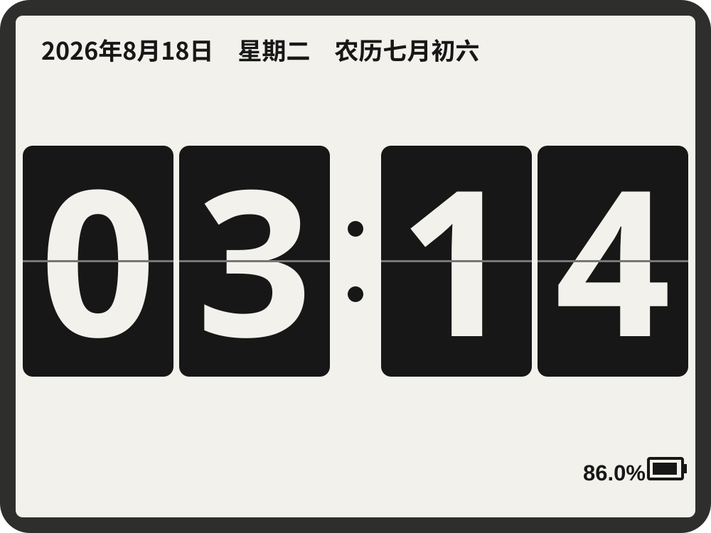

# kfc (Kindle Flip Clock)

[中文说明](README.md) · A full-screen KUAL flip-clock-style display for the Kindle 4 Non-Touch (K4NT).

**Current version: 2.5.3** · [Download the latest release](https://github.com/Arrow36/kindle4-flip-clock/releases/latest) · [Changelog](CHANGELOG.md)



The extension shows the time, Gregorian date, weekday, Chinese lunar date, and battery level. Screen orientation, 12/24-hour mode, and light/dark themes are controlled with the Kindle's physical keys while the clock is running.

The current release caches digit cards, prepares only the changed part of the next minute, and publishes that region directly through the framebuffer without an animated transition.

## What changed in 2.5.3 (Closed-loop adaptive PPM drift calibration)

To address individual crystal variations, ambient temperature fluctuations, and crystal aging, this release introduces **closed-loop adaptive learning based on measured NTP offsets** (`AUTO_DRIFT_CALIBRATION=1`) on top of 2.5.2's feedforward voltage curve:

1. **Closed-Loop Dynamic PPM Drift Calibration**:
   - **Rationale**: While 2.5.2 provided an accurate voltage-based baseline curve (5400 PPM), individual 32.768kHz crystals exhibit manufacturing tolerances ($\pm 5\sim 10\text{ PPM}$), and ambient room temperature swings (day/night) cause persistent frequency drift. A purely static feedforward lookup would still accumulate drift over weeks of operation.
   - **Implementation**:
     - `sntp.lua` records the elapsed interval $T_{\text{elapsed}}$ and measured residual offset $\Delta t$ at each successful sync, computes the actual drift rate $\Delta \text{PPM} = \frac{-\Delta t}{T_{\text{elapsed}}} \times 10^6$, and writes it to `/tmp/kfc/last_sntp_sync`.
     - `start.sh` calculates a damped adjustment step ($\alpha = 0.5$, $\text{Step} = \Delta \text{PPM} / 2$, clamped to $\pm 1500\text{ PPM/hr}$) to calibrate smoothly without overshooting or hunting.
     - Adds accumulated integral trim $\text{Trim}$ ($[-3000, +3000]\text{ PPM}$) onto the feedforward baseline:
       $$\text{Effective PPM} = \text{clamp}(\text{Base}(V) + \text{Trim}, 0, 8000)$$
     - Recalculates effective PPM on each resume from RTC suspend, achieving per-device zero-drift operation.
2. **Robust Bounds and Offline Stability**:
   - Updates only when sync intervals are between 30 minutes and 3 hours ($1800\text{s} \le T_{\text{elapsed}} \le 10800\text{s}$) with sane offsets ($|\Delta t| \le 60\text{s}$).
   - If Wi-Fi fails or the device is offline, the last converged trim value is maintained without loss or degradation.
   - Settings schema upgraded to `SETTINGS_VERSION=6` with `AUTO_DRIFT_CALIBRATION=1` enabled by default.

## What changed in 2.5.2 (PPM curve optimization & brownout protection)

Based on a complete 150-hour (6.21-day) empirical discharge test, this release fine-tunes crystal oscillator drift compensation across voltages and adds low-battery shutdown prevention:

1. **Piecewise Continuous Voltage-Scaled PPM Drift Compensation**:
   - **Rationale**: Telemetry revealed the 32.768kHz crystal runs fast by ~18.5s/h at high battery voltage ($\ge 4050\text{mV}$). The legacy default of `PPM=1414` only set back ~4.8s/h, leaving ~13.7s/h fast drift. Across the transition zone ($3950 \sim 4050\text{mV}$), drift reduces linearly to 0s/h at ~3960mV before crystal inversion.
   - **Implementation**: Added `calc_effective_ppm()` and raised the reference default from 1414 to **5400**:
     - $\ge 4050\text{mV}$: Full baseline PPM (5400, compensating ~18.3s/h fast drift, minimizing error to $\pm 1\text{s}$)
     - $3950\text{mV} \sim 4050\text{mV}$: Linearly ramps from 0 to full PPM (e.g., 2700 PPM at 4000mV, compensating ~9.1s/h drift)
     - $< 3950\text{mV}$: Completely suppressed (`EFFECTIVE_PPM=0`) to avoid compounding low-voltage crystal lag
     - Custom `RTC_DRIFT_COMPENSATION_PPM` in `settings.conf` scales proportionately.

2. **Low-Battery Wi-Fi Inrush Protection (Brownout Prevention)**:
   - **Rationale**: In real-world battery exhaustion tests, initiating Wi-Fi at 3432mV (3%) drew a 200–300mA inrush current spike that caused cell voltage sag to breach the PMIC low-voltage cutoff, causing an abrupt brownout.
   - **Implementation**: Hourly auto-sync now inspects cell voltage; if $< 3550\text{mV}$ (~7% battery), it skips Wi-Fi activation and relies on local RTC suspend, allowing the device to safely drain its remaining capacity.

## What changed in 2.5.1 (Field-tested fixes & optimizations)

Based on a 144.5-hour (~6-day) complete discharge run and long-term diagnostic telemetry, this release addresses battery percentage distortion, missed hourly NTP synchronizations, and low-voltage clock drift:

1. **Empirical Voltage-Based Battery Percentage Model (Fixes persistent 0% bug)**:
   - **Rationale**: The Kindle 4 fuel gauge coulomb counter (`gasgauge-info -c`) suffers from severe charge-integration decay during frequent Suspend-to-RAM cycles and on aging batteries. In a 144.5-hour discharge test, the coulomb counter dropped to 0% after just 18 hours (with cell voltage still at 4038mV), leaving the clock running for another 127 hours (88% of total battery life) displaying 0%. Physical cell voltage does not drift with sleep cycles.
   - **Implementation**: Added `get_battery_voltage()` (`gasgauge-info -v` and sysfs fallback) and `calc_battery_from_voltage()`. Implemented a calibrated piecewise non-linear interpolation model ($\ge 4120\text{mV} \to 100\%$, $4050\text{mV} \to 85\%$, $3950\text{mV} \to 70\%$, $3850\text{mV} \to 55\%$, $3770\text{mV} \to 40\%$, $3700\text{mV} \to 25\%$, $3620\text{mV} \to 15\%$, $3520\text{mV} \to 5\%$, $3420\text{mV} \to 1\%$, shutdown cutoff ~3413mV). `get_battery_level()` now prioritizes physical voltage, using the coulomb counter only as a fallback.

2. **Fixed Hourly Auto-SNTP Interval Boundary Skip Bug**:
   - **Rationale**: Periodic synchronization runs on the hour, but Wi-Fi initialization, DHCP, and SNTP take 6–10 seconds, landing completion around `XX:00:07`. When the next top-of-hour arrives, elapsed time is ~3593 seconds ($< 3600\text{s}$), causing the check to falsely report that the interval has not yet elapsed and skipping the hour, turning a 1-hour interval into a 2-hour interval.
   - **Implementation**: Added a 300-second (5-minute) threshold margin (`AUTO_TIME_SYNC_INTERVAL_HOURS * 3600 - 300`) to guarantee reliable hourly execution.

3. **Voltage-Adaptive RTC Drift Compensation Suppression**:
   - **Rationale**: Physical measurements showed the 32.768kHz crystal oscillator frequency shifts with battery voltage. While the battery is full ($\ge 3950\text{mV}$), the crystal runs fast, and `PPM=1414` setback (~5s/h) works well. At lower voltages ($< 3950\text{mV}$), the hardware oscillator naturally slows down (~15s/h slow). Continuing to apply a 5s/h setback added unnecessary reverse lag (leading to +21s/h lag).
   - **Implementation**: The RTC drift logic dynamically reads `$RUNTIME_DIR/battery.volt` and suppresses setback (`EFFECTIVE_PPM=0`) below 3950mV.

4. **Continuous Physical Voltage Telemetry & IPC**:
   - **Rationale**: Enables battery health tracking and exports voltage state across subshells.
   - **Implementation**: Logs physical millivolts at startup and hourly sampling windows (e.g. `battery refresh sample: old=85 new=85 (4052mV)`) and records to `$RUNTIME_DIR/battery.volt`.

## What changed in 2.5.0

- Added configurable periodic SNTP synchronization, checked hourly and scheduled from the last successful synchronization.
- Added passive NTP offset checks and configurable `RTC_DRIFT_COMPENSATION_PPM` suspend-clock compensation.
- Wi-Fi shutdown now also applies the Kindle hardware RF-kill property.
- Wi-Fi, synchronization, and battery-settle durations use monotonic `/proc/uptime` measurements and are unaffected by SNTP wall-clock steps.
- Idle suspend now starts after 15 seconds; the hourly full refresh waits 25 seconds for one final battery sample without per-second queries or logs.
- Fixed `--check-only` modifying system time and positive synchronization intervals always running every hour.
- Increased the log limit to 4 MiB and upgraded the settings schema to version 5.

See [CHANGELOG.md](CHANGELOG.md) for the complete release notes.

## Features

- Four screen orientations
- 12-hour and 24-hour formats
- Light and dark themes
- Gregorian date, weekday, Chinese lunar date, and battery percentage
- ByteDance Douyin Sans font
- Changed-digit pre-rendering and direct partial framebuffer refreshes
- Clear-then-redraw full refresh at startup, every hour, and after successful synchronization
- Back forces a full refresh; Home safely exits
- Keyboard-key manual synchronization directly through KOReader LuaSocket SNTP
- Configurable periodic synchronization and optional passive hourly offset checks
- Alibaba Cloud NTP defaults: `ntp1.aliyun.com`, `ntp2.aliyun.com`, and `ntp.aliyun.com`
- Persistent settings and physical-key shortcuts
- First-frame validation before the Kindle framework is stopped
- Wi-Fi off while the clock runs, temporarily enabled for synchronization, and restored to its launch-time state on exit
- RTC Suspend-to-RAM after 15 seconds without a physical-key press; the power button wakes the Kindle and restarts the awake interval
- A persistent renderer avoids loading KOReader graphics libraries and rebuilding digit cards every minute
- Runtime frames, PIDs, and events in `/tmp/kfc`; persistent USB-visible logs in `kfc/logs`

## Tested setup

- Kindle 4 Non-Touch
- Firmware 4.1.4
- Jailbreak and [KUAL](https://www.mobileread.com/forums/showthread.php?t=203326)
- [KOReader](https://github.com/koreader/koreader) installed at `/mnt/us/koreader`

Other Kindle models use different resolutions, framebuffer rotations, and key codes and are not currently supported.

## Installation

1. Download and extract the latest ZIP from [Releases](https://github.com/Arrow36/kindle4-flip-clock/releases).
2. Copy the complete `kfc` directory to the Kindle's `extensions` directory.
3. Verify that the final path is `/mnt/us/extensions/kfc`.
4. Safely eject the Kindle.
5. Select `kfc` in KUAL.

Do not rename the `kfc` directory; the current scripts use an absolute path.

### Upgrading from an older release

Version 2.2.3 renamed the extension directory from `kclock` to lowercase `kfc`. Exit the running clock and back up `settings.conf` before upgrading. Version 2.5.0 uses settings schema 5 and adds automatic synchronization, RTC drift compensation, and new power defaults. Remove `/mnt/us/extensions/kclock` only after the new version starts correctly.

## Physical-key shortcuts

| Key | Action | K4NT key code |
|---|---|---:|
| Left previous-page | Previous screen orientation | 193 |
| Left next-page | Next screen orientation | 104 |
| Right previous-page | Toggle light/dark theme | 109 |
| Five-way center | Toggle 12/24-hour format | 194 |
| Keyboard | Synchronize time now | 29 |
| Menu | Show/hide shortcut help | 139 |
| Back | Clear and force a complete redraw | 158 |
| Home | Exit | 102 |

The directional pad and right next-page key are currently unassigned.

## Configuration

`kfc/settings.conf` contains:

```sh
SETTINGS_VERSION=6
ORIENTATION=landscape_left
HOUR_MODE=24
THEME=dark
TIMEZONE=CST-8
TIME_SYNC_TIMEOUT=45
NTP_SERVERS="ntp1.aliyun.com ntp2.aliyun.com ntp.aliyun.com"
AUTO_TIME_SYNC_INTERVAL_HOURS=1
AUTO_TIME_CHECK_HOURLY=0
RTC_DRIFT_COMPENSATION_PPM=5400
AUTO_DRIFT_CALIBRATION=1
IDLE_SUSPEND_SECONDS=15
RTC_WAKE_LEAD_SECONDS=3
PARTIAL_REFRESH_DURATION_MS=800
FULL_REFRESH_DURATION_MS=1400
BATTERY_REFRESH_SETTLE_SECONDS=25
DEBUG_LOG=0
LOG_MAX_BYTES=4194304
```

`TIMEZONE` uses POSIX TZ syntax. Note that the sign is reversed compared with the usual UTC notation; UTC+8 is written as `CST-8`. `TIME_SYNC_TIMEOUT` accepts 10–180 seconds. `AUTO_TIME_SYNC_INTERVAL_HOURS` accepts 0–72 (`0` disables it), `AUTO_TIME_CHECK_HOURLY=1` enables passive checks, and `RTC_DRIFT_COMPENSATION_PPM=0` disables baseline drift compensation. `AUTO_DRIFT_CALIBRATION=1` enables closed-loop adaptive drift learning from hourly NTP offsets (`0` disables learning and uses static voltage scaling). `IDLE_SUSPEND_SECONDS` accepts 5–3600 seconds, `RTC_WAKE_LEAD_SECONDS` accepts 1–10 seconds, both fixed refresh-duration estimates accept 100–5000 milliseconds, and `BATTERY_REFRESH_SETTLE_SECONDS` accepts 0–50 seconds.

## Rendering

The extension uses KOReader's LuaJIT, FreeType, and BlitBuffer. A persistent worker receives `RENDER`, `PREPARE`, `DISPLAY`, and clock-adjustment commands over a FIFO. Full frames are still encoded as 600×800 PNGs for startup, hourly cleanup, setting/help changes, synchronization, and fallbacks. Ordinary minutes compare four digits, assemble only the changed card region, rotate it to physical framebuffer coordinates, copy it into `/dev/fb0`, and submit an eInkFB partial update. The worker keeps its font faces, digit cache, framebuffer mapping, and prepared region alive between minutes. After 15 seconds without a key press, the clock suspends and requests an RTC wake three seconds before the next target. Home restores Wi-Fi, the sleep policy, and the Kindle framework before exit.

Logs:

```text
/mnt/us/extensions/kfc/logs/launcher.log
/mnt/us/extensions/kfc/logs/kfc.log
```

## Font

`kfc/fonts/DouyinSansBold.ttf` is the official Douyin Sans Bold file from [ByteDance Fonts](https://github.com/bytedance/fonts). It is redistributed under the SIL Open Font License 1.1; see `kfc/fonts/OFL.txt`.

## Known limitations

- Designed for the Kindle 4 Non-Touch 600×800 framebuffer and its physical key codes.
- RTC low-power phase scheduling requires `/sys/devices/platform/mxc_rtc.0/wakeup_enable` and the adjacent `rtc_pmic_epoch_time`; when unavailable, the clock remains awake and uses the system clock for scheduling.
- Battery estimation prioritizes physical voltage piecewise interpolation (`gasgauge-info -v` / sysfs) calibrated against real-device discharge curves, falling back to `gasgauge-info -c`; other Kindle models may have different voltage sysfs paths and discharge curves.
- Lunar dates are supported from 1900 through 2100.
- Seconds and per-second updates are intentionally omitted.
- Minute changes use direct refreshes and do not include a flip animation.
- Kindle 4 suspend/resume can make the system wall clock run fast; long unattended sessions still benefit from periodic SNTP synchronization.
- The eInkFB ioctl may return before the visible waveform finishes, so recorded return time is not the physical end of screen motion.
- Manual SNTP crossing a minute boundary can briefly race with minute publication; the subsequent re-anchor and full redraw recover the display.
- If the Kindle environment does not expose a sub-second `usleep`, the fallback rounds waits to whole seconds and refresh submission can be later than planned; inspect `kfc.log` offsets when tuning.

## Credits and license

Inspired by [LaisRast/kclock](https://github.com/LaisRast/kclock). This public edition removes the original SVG/rsvg/pngcrush pipeline and uses a new Lua/KOReader renderer.

Code is licensed under the [MIT License](LICENSE). The bundled font remains under its separate [SIL Open Font License 1.1](kfc/fonts/OFL.txt). See [NOTICE.md](NOTICE.md).

Use jailbreak software and third-party extensions at your own risk.
